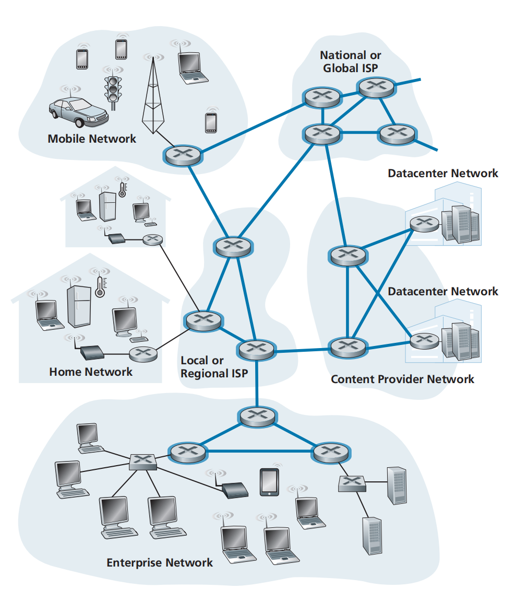
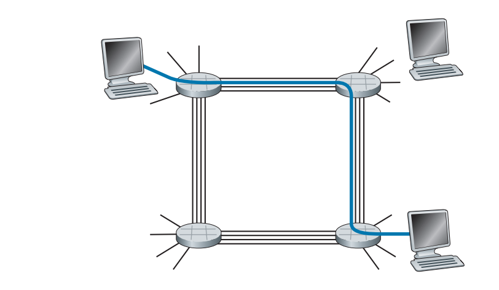
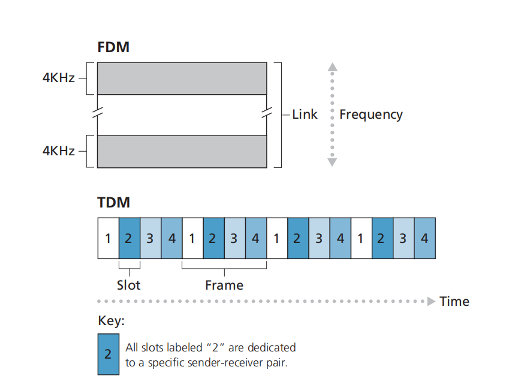

### 1.3.0 网络核心概述

网络核心由**分组交换机（packet switches）** 和 **通信链路（links）** 组成，连接互联网的端系统。

核心设备包括**路由器（router）** 和 **链路层交换机（link-layer switch）**。

### 1.3.1 **分组交换（Packet Switching）**

- 终端系统通过**分组（packet）** 发送数据，而不是整个消息一次性传输。
- 核心设备包括**路由器（router）** 和 **链路层交换机（link-layer switch）**。
- **存储转发（Store-and-Forward）** 机制：
  - 路由器必须**接收整个数据包后**，才能将其转发到下一条链路。
  - 传输时间公式：
    - $\text{单跳时延} = \frac{L}{R}$
    - $\text{端到端时延} = N \times \frac{L}{R}$
    - （其中 $L$ 是数据包大小，$R$ 是链路速率，$N$ 是链路数量）
  - 如果网络采用**按比特转发**，传输时延可以减少。
- **队列时延（Queuing Delay）与丢包（Packet Loss）**
  - **每个路由器的输出端口** 设有**输出缓冲区（output buffer）**。
  - **当多个数据包竞争同一条链路时**，排队等待传输，产生**排队时延（queuing delay）**。
  - 如果**缓冲区满了**，新到达的数据包将被**丢弃**，导致**丢包（packet loss）**。
  - 类比：在银行排队等待服务，如果排队的人太多，有人可能被拒绝服务。
- **转发表（Forwarding Table）和路由协议（Routing Protocols）**
  - **路由器如何选择转发路径？**
    - 每个端系统都有一个**IP 地址**，用于标识目的地。
    - **路由器维护转发表（forwarding table）**，用于**查找数据包的目的地** 并选择合适的下一跳路由器。
    - **查找过程类似于驾驶导航**：
      - 司机根据目标地址（IP 地址）逐步询问方向（路由器查找转发表），最终到达目的地。
  - **路由协议自动更新转发表**
    - 互联网使用**路由协议（Routing Protocols）** 自动计算最优路径，如**最短路径算法**。

### 电路交换（**Circuit Switching**）

- **电路交换 vs. 分组交换**

  - **电路交换（Circuit Switching）**：通信前需**预留**端到端的资源（带宽、缓冲区）。
  - **分组交换（Packet Switching）**：不预留资源，数据按需传输，可能产生排队和丢包。
  - **类比**：
    - **电路交换** = 需要**预订座位**的餐厅，保证有座，但可能空置浪费资源。
    - **分组交换** = **无需预订**的餐厅，可能需要排队，但能最大化利用座位。

- **电路交换的工作原理**
  
  - **建立连接（Call Setup）**：
    - 发送端和接收端之间先建立一条**专用电路**（Circuit）。
  - **资源预留（Resource Reservation）**：
    - 链路上的带宽被固定分配给该连接，即使暂时不用也不会释放。
  - **数据传输（Data Transmission）**：
    - 预留带宽确保稳定的传输速率，无需排队等待。
  - **释放连接（Teardown）**：
    - 结束通信后，释放已预留的资源。
- **电路交换的多路复用（Multiplexing）**
  
  - **频分复用（FDM，Frequency-Division Multiplexing）**
    - 将链路的**频率范围**划分成多个通道，每个连接占用一个固定的频段。
    - **应用**：调频广播（FM 88 MHz - 108 MHz）、传统电话网络（4 kHz 语音通道）。
  - **时分复用（TDM，Time-Division Multiplexing）**
    - 将时间划分为多个**时间片（Time Slot）**，每个连接固定分配一个时间片。
    - **示例**：TDM 电话网络，每个时隙 8,000 帧/秒 × 8 bit = **64 kbps**。
- **电路交换 vs. 分组交换的对比**
  | **对比项** | **电路交换（Circuit Switching）** | **分组交换（Packet Switching）** |
  | -------------- | --------------------------------- | -------------------------------- |
  | **资源管理** | 预先分配资源，保证稳定性 | 按需分配资源，提高利用率 |
  | **延迟** | 低延迟，无排队 | 可能有排队和丢包 |
  | **带宽利用率** | 低（不使用时也占用带宽） | 高（动态共享带宽） |
  | **适用场景** | 传统电话网络（语音通信） | 互联网、数据传输 |
  | **实现复杂度** | 复杂（需要信令协议） | 相对简单 |

- **为何分组交换更高效？**
  - **统计复用（Statistical Multiplexing）**：
    - 大多数网络应用（如网页浏览、文件下载）**数据传输间歇性**，不会一直占用带宽。
    - 分组交换允许多个用户共享带宽，提高利用率。
  - **动态分配带宽**：
    - 若用户 A 处于“空闲”状态，用户 B 可以使用全部带宽。
  - **现代网络趋势**：
    - **大多数通信已经向分组交换发展**，包括**电话网络**（VoIP）、视频流（Netflix）等。
    - **即使是电话网络**，长途或国际通话通常也会在骨干网部分使用**分组交换**。

### 电路交换（**Circuit Switching**）

- **电路交换 vs. 分组交换**
  - **电路交换（Circuit Switching）**：通信前需**预留**端到端的资源（带宽、缓冲区）。
  - **分组交换（Packet Switching）**：不预留资源，数据按需传输，可能产生排队和丢包。
  - **类比**：
    - **电路交换** = 需要**预订座位**的餐厅，保证有座，但可能空置浪费资源。
    - **分组交换** = **无需预订**的餐厅，可能需要排队，但能最大化利用座位。

---

- **电路交换的工作原理**
  
  - **建立连接（Call Setup）**：
    - 发送端和接收端之间先建立一条**专用电路**（Circuit）。
  - **资源预留（Resource Reservation）**：
    - 链路上的带宽被固定分配给该连接，即使暂时不用也不会释放。
  - **数据传输（Data Transmission）**：
    - 预留带宽确保稳定的传输速率，无需排队等待。
  - **释放连接（Teardown）**：
    - 结束通信后，释放已预留的资源。
- **电路交换的多路复用（Multiplexing）**
  
  - **频分复用（FDM，Frequency-Division Multiplexing）**
    - 将链路的**频率范围**划分成多个通道，每个连接占用一个固定的频段。
    - **应用**：调频广播（FM 88 MHz - 108 MHz）、传统电话网络（4 kHz 语音通道）。
  - **时分复用（TDM，Time-Division Multiplexing）**
    - 将时间划分为多个**时间片（Time Slot）**，每个连接固定分配一个时间片。
    - **示例**：TDM 电话网络，每个时隙 8,000 帧/秒 × 8 bit = **64 kbps**。
- **电路交换 vs. 分组交换的对比**

  | **对比项**     | **电路交换（Circuit Switching）** | **分组交换（Packet Switching）** |
  | -------------- | --------------------------------- | -------------------------------- |
  | **资源管理**   | 预先分配资源，保证稳定性          | 按需分配资源，提高利用率         |
  | **延迟**       | 低延迟，无排队                    | 可能有排队和丢包                 |
  | **带宽利用率** | 低（不使用时也占用带宽）          | 高（动态共享带宽）               |
  | **适用场景**   | 传统电话网络（语音通信）          | 互联网、数据传输                 |
  | **实现复杂度** | 复杂（需要信令协议）              | 相对简单                         |

- **为何分组交换更高效？**
  - **统计复用（Statistical Multiplexing）**：
    - 大多数网络应用（如网页浏览、文件下载）**数据传输间歇性**，不会一直占用带宽。
    - 分组交换允许多个用户共享带宽，提高利用率。
  - **动态分配带宽**：
    - 若用户 A 处于“空闲”状态，用户 B 可以使用全部带宽。
  - **现代网络趋势**：
    - **大多数通信已经向分组交换发展**，包括**电话网络**（VoIP）、视频流（Netflix）等。
    - **即使是电话网络**，长途或国际通话通常也会在骨干网部分使用**分组交换**。

### 1.3.4 网络的网络（**A Network of Networks**）

- **互联网的基础结构**
  - 终端系统（PC、手机、服务器等）通过 **接入 ISP（Access ISP）** 连接到互联网。
  - 接入 ISP 提供有线或无线连接，如 **DSL、光纤、WiFi、蜂窝网络**。
  - **但光有接入 ISP 还不够**，不同的接入 ISP 需要互联，形成一个**网络的网络**（Network of Networks）。
- **互联网的分层结构**
  - 互联网是由**多个 ISP（互联网服务提供商）** 互联形成的**分层网络**。
  - **网络层次结构的演变**：
    - **结构 1**：所有接入 ISP 连接到一个**全球主干 ISP（Global Transit ISP）**，但成本过高。
    - **结构 2**：多个全球 ISP 竞争，但它们仍需要互联，以确保所有 ISP 用户都能互相通信。
    - **结构 3**：区域 ISP（Regional ISP）加入网络，每个区域 ISP 连接到上层 ISP（称为 **Tier-1 ISP**）。
    - **结构 4**：加入 **PoPs（接入点）、多归属（Multi-homing）、对等互联（Peering）、IXP（互联网交换点）**，使网络更优化。
    - **结构 5（现代互联网）**：大型内容提供商（如 Google）**自建全球私有网络**，绕过部分 Tier-1 ISP 以降低成本、提高性能。
- **互联网服务提供商（ISP）层级**
  - **Tier-1 ISP（一级 ISP）**：
    - 负责全球网络互联，如 **AT&T、Level 3、Sprint、NTT** 等。
    - 互相对等连接（Peering），**不向其他 ISP 支付费用**。
  - **Tier-2 ISP（区域 ISP）**：
    - 连接多个接入 ISP，**向 Tier-1 ISP 付费**获取全球互联能力。
    - 也可以 **Peering**（对等互联），减少 Tier-1 费用。
  - **Tier-3 ISP（接入 ISP）**
    - 直接向最终用户（家庭、企业、大学）提供互联网接入。
    - 付费连接上级 ISP。
- **互联网交换点（IXP）和 Peering**
  - **IXP（Internet Exchange Point，互联网交换点）**
    - **第三方机构运营**，提供一个平台让多个 ISP **直接互联**，减少对上层 ISP 的依赖，降低成本。
    - 目前全球有 **600+ IXP**（如 AMS-IX、LINX）。
  - **Peering（对等互联）**
    - **同一级别 ISP 直接互联**，流量不经过上级 ISP。
    - 这种连接通常**是免费（settlement-free）的**。
- **内容提供商的网络（CDN 和私有网络）**
  - **传统模式**：内容提供商（如 Google、Netflix）必须**付费使用 ISP** 提供的网络。
  - **现代模式（Google, Facebook, Netflix 等）**：
    - **自建全球私有网络**，连接多个 ISP，绕开 Tier-1 ISP，**减少费用，提高性能**。
    - **内容分发网络（CDN，Content Delivery Network）**：
      - 通过在多个数据中心缓存内容，**减少用户访问延迟**。
      - 例如，**YouTube、Netflix 通过 CDN 直接向用户提供内容**，避免拥塞和长距离传输。

### 1.3.5 **_要点总结_**

- **分组交换（Packet Switching）**
  | **概念**            | **要点**                                                                   |
  | ------------------- | -------------------------------------------------------------------------- |
  | **分组交换**        | 数据以**数据包（packet）** 形式传输，采用**存储-转发机制**。               |
  | **存储转发**        | 路由器必须**接收完整数据包** 后才能转发，端到端时延 **=** $N \times L/R。$ |
  | **队列时延 & 丢包** | 链路拥塞会导致数据包排队，缓冲区满时会**丢包**。                           |
  | **路由 & 转发**     | **路由器** 依据 **IP 地址** 查找 **转发表**，选择**最佳路径**转发数据。    |
  | **路由协议**        | 自动更新转发表，优化数据传输路径（如**最短路径算法**）。                   |
- 电路交换（**Circuit Switching**）
  - **电路交换需建立连接并预留带宽**，适用于语音通信，但资源利用率低。
  - **电路交换采用 FDM 和 TDM 进行多路复用**，但未使用的资源会浪费。
  - **分组交换更适合互联网数据传输**，因其带宽利用率更高，且无需事先预留资源。
  - **现代通信正逐步向分组交换过渡**，包括**语音、视频、数据**等业务。
  - **结论：分组交换比电路交换更灵活、更高效，已成为现代网络的主流技术！**
- 网络的网络（**A Network of Networks**）
  - **互联网是一个“网络的网络”**，通过多层次 ISP 连接全球终端用户。
  - **ISP 具有分层结构**：
    - **Tier-1 ISP（全球骨干网）**，彼此 Peering，**不向他人付费**。
    - **Tier-2 ISP（区域 ISP）**，向 Tier-1 付费，同时与其他 ISP Peering
    - **Tier-3 ISP（接入 ISP）**，提供家庭和企业接入，向上级 ISP 付费。
  - **IXP（互联网交换点）** 允许 ISP 之间直接互联，减少依赖上级 ISP，降低成本。
  - **内容提供商（Google、Netflix）** 通过 **CDN 和自建网络** 直接连接低级 ISP，减少对 Tier-1 的依赖。
  - **现代互联网是一个复杂的生态系统，由 ISP、IXP、Peering 和 CDN 共同构建，以提供更高效的全球连接。**
