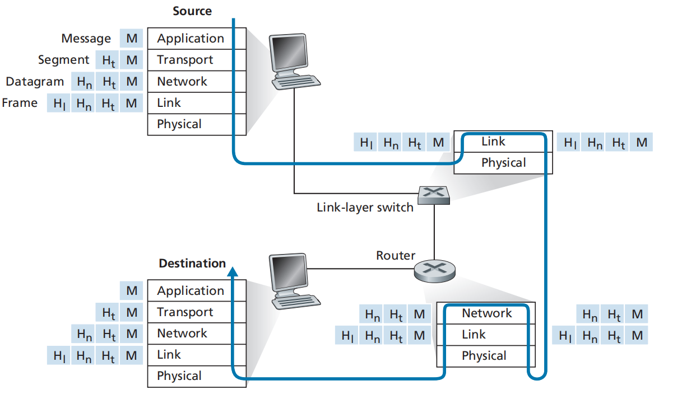

### **1.5.0 为什么需要协议分层？**

- 互联网系统极其复杂，包含多个应用、协议、终端系统、分组交换设备、链路介质等。
- 为了应对复杂性，采用**分层架构（Layered Architecture）**是组织网络结构和便于讨论的有效方法。

### **1.5.1 分层的体系结构**

- **通过航空系统的类比说明分层思想**
  - 航空旅行可被分为多个功能层次：
    - **订票层**：售票与投诉服务；
    - **行李层**：托运行李与领取行李；
    - **登机口层**：登机与下机；
    - **起飞/降落层**：跑道起飞与降落；
    - **飞行路径层**：飞行中路径控制。
  - 各层级按需服务：上层依赖下层的服务，形成**水平分层结构**。
  - 分层优势：
    - **模块化设计**：只要接口不变，每层的内部实现可以随时更改，不影响其他层；
    - **简化系统更新与维护**。
- **协议分层**
  - 网络协议和其实现的硬件/软件也被组织在分层结构中，每个协议属于一个特定层。
  - 每层通过：
    - 层内特定功能的实现；
    - 调用下层服务；
  - 来为上层提供服务，即**服务模型（Service Model）**。
  - **优势：**
    - 提供清晰的系统组织结构；
    - 模块化更新简化系统维护。
  - **劣势：**
    - 层间功能可能**冗余**（如多层都做错误恢复）；
    - 某层可能**需要其他层的信息**，打破层的独立性。
- **互联网协议栈的五层结构**（从上到下）：
  1. **应用层（Application Layer）**
     - 提供网络应用和协议：如 HTTP、SMTP、FTP、DNS。
     - 通常通过**软件实现**，运行在终端系统。
     - 应用层交换的信息单位：报文（**Message）**。
  2. **传输层（Transport Layer）**
     - 在应用端点间传输应用层消息。
     - 两种主要协议：
       - **TCP**：面向连接，提供可靠性、流量控制、拥塞控制；
       - **UDP**：无连接，提供简单、不可靠的数据传输。
     - 数据单位：报文段（**Segment）**。
  3. **网络层（Network Layer）**
     - 负责从源主机到目的主机的**数据报（Datagram）**转发。
     - 核心协议：**IP（Internet Protocol）**，所有网络设备必须支持。
     - 包含多个**路由协议**，决定路径选择。
  4. **链路层（Link Layer）**
     - 实现节点之间（如主机或路由器）的一跳转发。
     - 依赖具体链路协议，如以太网、WiFi、DOCSIS。
     - 数据单位：帧（**Frame）**。
  5. **物理层（Physical Layer）**
     - 在链路上传输比特流（Bits），依赖物理媒介和协议。
     - 示例媒介：双绞铜线、光纤、同轴电缆。
  - **术语小结**
    | **层级** | **关键术语** | **描述** |
    | -------- | ------------ | -------------------- |
    | 应用层 | Message | 应用之间传输的消息 |
    | 传输层 | Segment | 传输层处理的分段数据 |
    | 网络层 | Datagram | 网络层传输的数据报 |
    | 链路层 | Frame | 链路层封装的帧 |
    | 物理层 | Bit | 物理传输的比特 |

### 1.5.2 **封装（Encapsulation）**



- **不同网络设备的分层结构**
  - **主机（Host）**：实现**五层协议栈**（应用层至物理层）。
  - **路由器（Router）**：实现**底三层**（物理层、链路层、网络层），可以识别和处理 IP 地址。
  - **链路层交换机（Link-layer Switch）**：实现**底两层**（物理层、链路层），只能识别 MAC 地址等链路层信息。
  - **互联网架构特点**：复杂性主要分布在网络边缘（即终端系统），核心网络保持相对简单。
- **封装的概念与流程**
  - 封装（Encapsulation）是**数据从发送端穿越协议栈各层**的过程，每一层都在数据前添加**首部信息（Header）**。
  - **📦 封装步骤（从上往下）：**
    1. **应用层**：
       - 原始数据为 **消息（Message）**。
    2. **传输层**：
       - 添加传输层首部（**Ht**），形成 **段（Segment）**。
       - 包含：目标应用信息、差错检测等。
    3. **网络层**：
       - 添加网络层首部（**Hn**），形成 **数据报（Datagram）**。
       - 包含：源地址、目的地址等。
    4. **链路层**：
       - 添加链路层首部（**Hl**），形成 **帧（Frame）**。
    5. **物理层**：
       - 以比特（**Bits**）形式实际传输数据。
- **封装结构的组成**
  - 每一层的传输单元包含两部分：
  - **Header（首部）**：该层控制和识别信息；
  - **Payload（有效载荷）**：来自上一层的完整数据单元。
- **信封类比说明（Interoffice Memo）**
  - 类比场景：Alice 向 Bob 发送一份公司内部备忘录：
    | **网络分层** | **类比对象** | **描述** |
    | ------------------ | ------------ | ---------------------- |
    | 应用层（Message） | 备忘录正文 | Alice 编写的消息内容 |
    | 传输层（Segment） | 内部信封 | 写有 Bob 的姓名与部门 |
    | 网络层（Datagram） | 邮政信封 | 写有源和目的公司地址 |
    | 链路层 & 物理层 | 传递方式 | 通过实际信道将信封传送 |
  - 在接收端，数据按反方向**逐层解封装（De-encapsulation）**，直到交给接收应用使用。
- **封装的复杂性**
  - 一个大型消息可能会：
  - 被拆分成多个 **段（Segments）**；
  - 每个段可能又被拆成多个 **数据报（Datagrams）**；
  - 接收方需进行 **重组**。
- **总结重点**
  - **封装**是网络通信的核心机制，每层为其上一层提供服务，通过添加控制信息的首部实现。
  - 数据在发送过程中由**应用层逐层向下封装**，在接收端**逐层向上解封装**。
  - 各设备（主机、路由器、交换机）在协议栈中实现的层级不同，功能也不同。

### 1.5.3 **_要点总结_**

1. **分层架构的动机与类比**
   - 互联网系统复杂，需要**结构化设计**以简化理解与实现。
   - 类比航空系统：将整体流程划分为若干层级（订票、行李、登机、飞行等），每层只关注自身职责，**通过分层实现模块化、独立性与可维护性**。
2. **协议分层的基本原理**
   - 每层通过：
     - **自身操作**；
     - **调用下层服务**；
   - 提供对上层的支持（即 **服务模型**）。
   - 各层间交换数据单位具有统一结构：**首部（Header）+ 载荷（Payload）**。
3. **互联网五层协议栈（Internet Protocol Stack）**

   | **层级** | **功能描述**                   | **典型协议**   | **数据单位** |
   | -------- | ------------------------------ | -------------- | ------------ |
   | 应用层   | 实现具体网络应用               | HTTP、FTP、DNS | Message      |
   | 传输层   | 应用端点之间的可靠/不可靠传输  | TCP、UDP       | Segment      |
   | 网络层   | 数据报从源主机到目的主机的传送 | IP、路由协议   | Datagram     |
   | 链路层   | 相邻节点间的数据帧传输         | Ethernet、WiFi | Frame        |
   | 物理层   | 通过物理媒介传输比特流         | 各类物理协议   | Bit          |

4. **设备分层能力**

   | **设备类型**     | **实现的层级**         | **功能说明**             |
   | ---------------- | ---------------------- | ------------------------ |
   | **主机**         | 应用层至物理层（五层） | 端到端通信的发起与终点   |
   | **路由器**       | 网络层及以下（三层）   | 实现路径选择与转发       |
   | **链路层交换机** | 链路层及物理层（两层） | 本地网络中帧的转发与识别 |

5. **封装（Encapsulation）机制**
   - 每一层向数据单元添加自己的**首部信息**，形成新数据结构：
     ```
     Frame = Hl + (Hn + (Ht + M))
     ```
   - 接收端按相反顺序逐层**解封装（De-encapsulation）**，最终将原始消息交给目标应用。
6. **分层的优缺点**
   - ✅ **优点**：
     - 模块化：便于设计、调试和更新；
     - 层与层间接口清晰，互不干扰。
   - ⚠️ **缺点**：
     - 功能可能**重复**（如多个层都处理错误控制）；
     - 某层可能需要其他层的信息，**打破层间独立性**。
